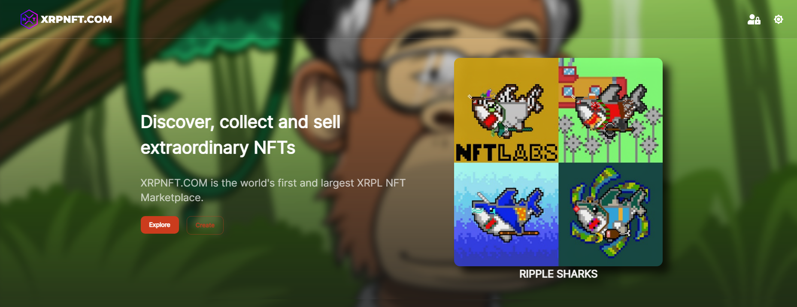
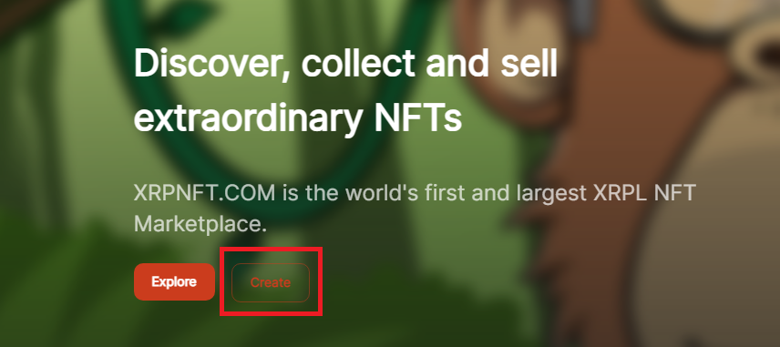
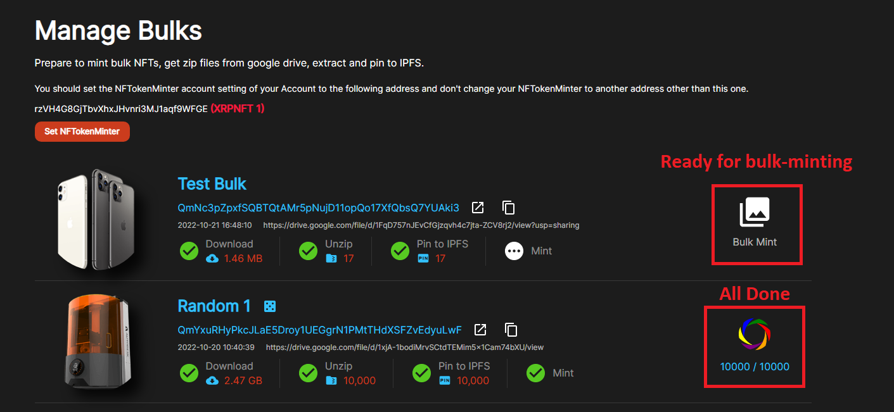

## XRP NFT Marketplace, Buy, Sell & Collect NFTs | [XRPNFT.com](https://xrpnft.com) (Front-End, Next.js)

A next generation NFT marketplace on the XRP ledger. Create, buy, sell, and auctions NFTs on the XRP blockchain without any barriers.

### Landing page

When you open the [XRPNFT.com](https://xrpnft.com) in your browser, you will see the landing page first.
On landing page, you can see the famous collections in carousel preview and NFTs in hot sell in the below.



### Create a NFT

After login with XUMM app, you can create your own NFT.
You can create a NFT directly from the landing page or from your account drop-down menu.

When you click ```Create``` button, you can see the mint nft page, from there input at least required fields and click Create button to finish.

### Create a Collection

From your account drop-down menu on the nav bar, click ```My Collections``` to see your collections page.
From there, you can create your own collections and previously created collections are displayed.
When creating a collection, you have to select your collection type.

There are 3 collections types ```Normal```, ```Bulk``` and ```Random```.

```Normal```: You can mint NFTs one by one for this collection.

```Bulk```: You can upload bulk NFTs and sell with Mints. All NFTs are listed in a collection.

```Random```: You can upload bulk NFTs and sell NFTs randomly one by one with Mints. Only Minted NFTs are listed in a collection. Mints are bought by costs.

```Sequence```: You can upload bulk NFTs and sell NFTs sequently one by one with Mints. Only Minted NFTs are listed in a collection. Mints are bought by costs.

If you select ```Bulk``` or ```Random```, you should add cost for each NFT and google drive shared link that indicates .zip file that contains all NFT images.
For now, XRPNFT.com only support Google Drive image uploading, you should zip your images and then upload to Google Drive and make sharable link.
When you create your collection, [XRPNFT.com](https://xrpnft.com) download your .zip file from the Google Drive, unzip it and pin all image files to IPFS.
After all process are done, you can start bulk-minting on ```Manage Bulks``` page.

At the bottom of your page, there is a ```Private``` option, if you make your collection private, others can not see your collection.
This can be used when you mint bulk NFTs, you can make it public by editing collection after you mint all NFTs or to meet your time that you want to make public.
For example, for Christmas, you can make your own collection and make it private until the time you congratulate the holiday and then tell your friends to check it.

### Create Bulk NFTs

After you created your own collection with the type ```Bulk``` or ```Random```, you can mint bulk NFTs.
From your account drop-down menu on the nav bar, click ```Manage Bulks``` to see the bulk-mint ready collections.


You can see the details of your collection, downloading and pinning are successful or not, if all are good, you can start mint bulk.
Click ```Bulk Mint``` button to mint bulk NFTs.

You should prepare your own metadata that contains bulk NFTs' metadata.

After you upload your metadata, [XRPNFT.com](https://xrpnft.com) mints NFTs automatically for you.

```NOTE``` You should set the NFTokenMinter account setting of your Account to the specified address and don't change your NFTokenMinter to another address while minting your NFTs. This is only when you want be the issuer of your NFTs. Your NFTs will have issuer field as your account address.

### How it works?

[XRPNFT.com](https://xrpnft.com) is built with Next.js React framework and implements SSR(Server Side Rendering) and SEO(Search Engine Optimization), works with the backend [api.xrpnft.com](https://api.xrpnft.com).

[XRPNFT.com](https://xrpnft.com) implements all NFT marketplace functions via APIs provided by api.xrpnft.com.

There are many apis including create, edit and list collection & NFT apis, XUMM login, payloads apis for creating transactions.

When you create a collection, buy or sell offer, you can select any tokens from XRPL and tokens information is from the [XRPL.to](https://xrpl.to) backend.
